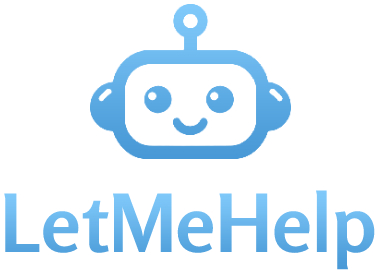
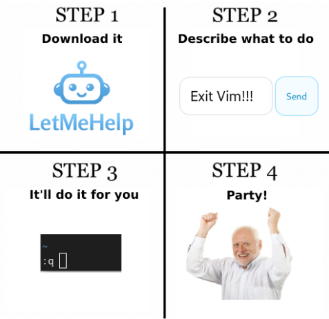
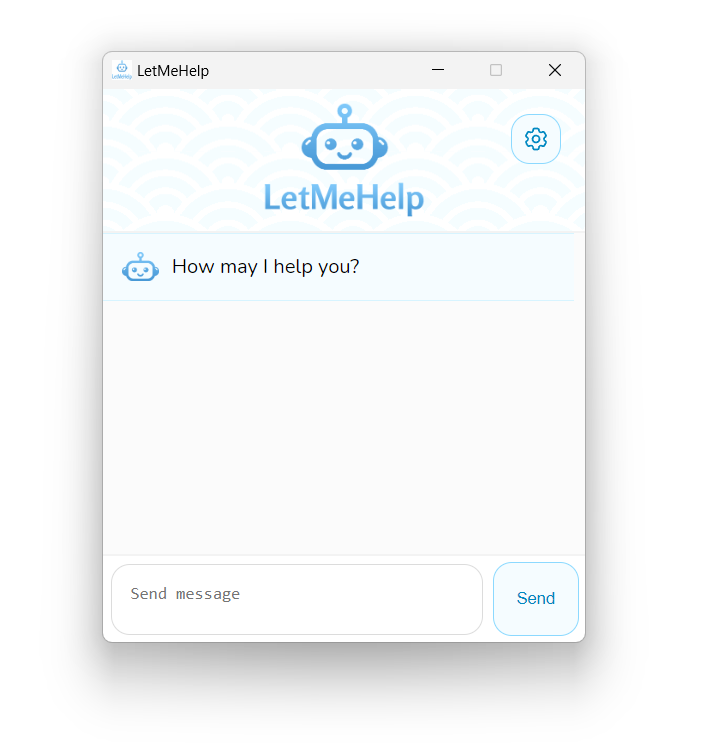

# LetMeHelp

## On-Demand AI-Powered Remote Support

An AI-powered solution to automatically perform actions on the computer based on the user query.

## [Google Slides Presentation](https://docs.google.com/presentation/d/1ejqZSFOikY8LfFfq9ocV9vMR6dUskckhHZTmvVDIW4E/edit#slide=id.g3068a5e32e5_0_69)

## Why did we make it?

* It’s a real problem we have (we're constantly approached by family and friends to solve their IT problems)
* Personal and enterprise use cases
* On-demand remote support is a big market
* Current solutions are not really feasible
  * No consumer product like LetMeHelp available yet
  * Not intuitive for non-developers
  * Hard to set up
  * Platform-specific
  * Limited capabilities

## How does it work?

Very simple! It has a cross-platform user client that talks to the API on a server with access to a visual large language model (VLLM).

## [Test Environment](test-environment/README.md)

## [User Client](user-client/README.md)

* Cross-platform
* Lightweight
* Simple
* Capabilities
    * Call system APIs
    * See the screen
    * Click anywhere
    * Type anything

## What have we learned from this project?

* There's a market gap for such a product (promising startup idea)
* Emerging research field
* VLMs are not good at locating UI elements yet
* VLMs downscale screenshots
* Hallucination is a problem
* Self-ask and reflection can help
* Don’t give all power to AI
* User experience matters most
* Fail fast
* SOTA research is all you need
