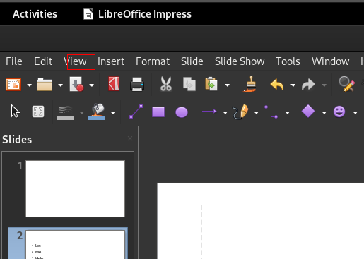

# SeeClick

## Repository

https://huggingface.co/cckevinn/SeeClick

## How to run

Create a Runpod.io instance as shown below, upload the Jupyter notebook, and run it.

After loading everything, the actual inference took about 20 seconds.

## Prompt

```
In this UI screenshot, what is the position of the element corresponding to the View menu (with bbox)?
```

## Result

It actually outputs `(0.05,0.07,0.07,0.09)`, in the format `(left, top, right, down)`.

The numbers are in the range `[0, 1]`, with `1` corresponding to width (for left and right) 
and height (for up and down) of the original image.

Given the original image resolution of 1918 pixels by 1054 pixels, these numbers can be converted into pixels with 
a simple multiplication, resulting in `(95.90, 73.78, 134.26, 94.86`).

The resulting bounding box is shown below. It is not 100% accurate, but much better.

We need to keep this `[0, 1]` in mind when evaluating other models.



## RunPod deployment configuration

