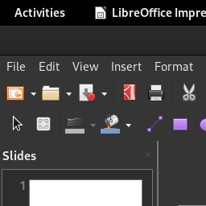
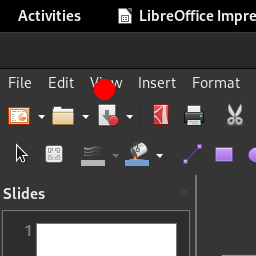
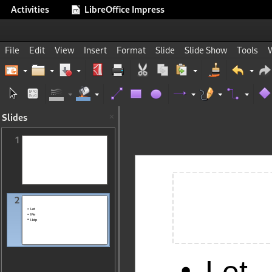
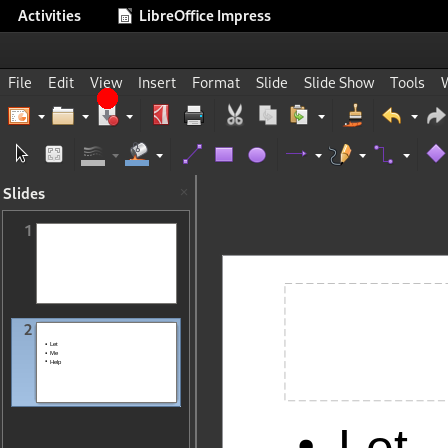
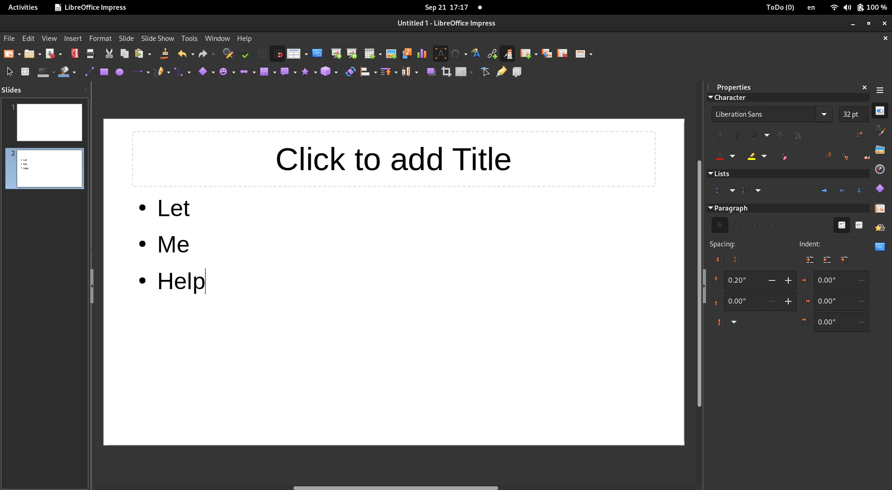
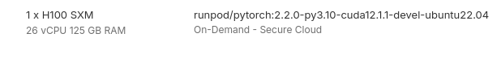

# SeeClick

## Repository

https://huggingface.co/cckevinn/SeeClick

## How to run

Create a Runpod.io instance as shown below, upload the Jupyter notebook, and run it.

After loading everything, the actual inference is less than 1 second (about 600 milliseconds)!

## Prompt

```
In this UI screenshot, what is the position of the element corresponding to the View menu (with point)?
```

## Result

It actually outputs `(0.05,0.07,0.07,0.09)` (in `bbox` mode`), in the format `(left, top, right, down)`.

The numbers are in the range `[0, 1]`, with `1` corresponding to width (for left and right) 
and height (for up and down) of the original image.

Given the original image resolution of 1918 pixels by 1054 pixels, these numbers can be converted into pixels with 
a simple multiplication, resulting in `(95.90, 73.78, 134.26, 94.86`).

The resulting bounding box is shown below. It is not 100% accurate, but much better.

**Note:** Qwen-VL scales the resolution to 448 so that it can be evaluated end-to-end!
We can use/fine-tune Qwen-VL-Max, which supports large resolution input images.

https://github.com/QwenLM/Qwen-VL

Another alternative is that we can do a trick, e.g. dividing the screenshot into 256x256 blocks,
asking it to highlight the area, marking it with a red box, and then passing this image to a VL model and ask if the 
target has a box around it.

## Test images

### 256 x 256 pixels



#### Results



### 448 x 448 pixels



#### Results



### 1918 x 1054 pixels (original)



#### Results


## RunPod deployment configuration

