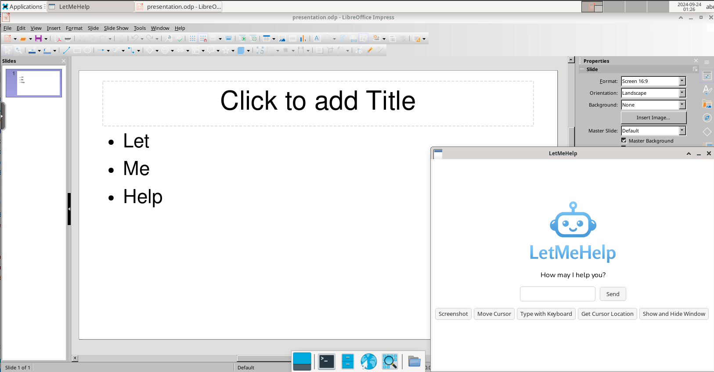

# Test Environment

## Linux

The test environment is powered by a Docker image based on [linuxserver/webtop](https://docs.linuxserver.io/images/docker-webtop),
running Debian 12 with the XFCE desktop environment. It also contains LibreOffice Impress (a Microsoft PowerPoint 
alternative).

The image is designed to launch the provided `presentation.odp` presentation on startup.

It will also check for the user client executable `/opt/letmehelp`, and if available, it will launch it on startup.

**Once the user client is ready, rename it to `letmehelp`, place it in the `test-environment/opt` folder, 
and rebuild the image.**

To build and run the Docker image:

```shell
docker build -t letmehelp-testenv:linux .
docker run --rm -d \
  --name=letmehelp-testenv-linux \
  -p 3000:3000 \
  letmehelp-testenv:linux
```

To stop it:

```shell
docker stop letmehelp-testenv-linux
```

After running the container, the test environment can be accessed in the browser at http://localhost:3000/.

Here is how it looks like every time it is started:



## Windows

Since Microsoft products like Windows and PowerPoint requires a license to run, we can create a VirtualBox 
machine and install trial versions of both.